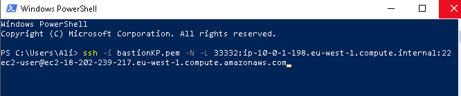
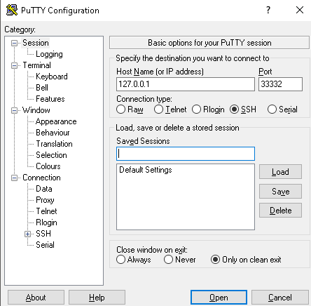

**Connecting to a private instance through a bastion with tunneling {for
Windows}**

**Description**

In the AWS architecture, we have a VPC with a linux instance in the
private subnet. The public subnet consists of another linux instance
(the bastion) and a NAT instance. The NAT instance will allow us to
execute a ping command from the private instance once we've established
an SSH connection with it through the bastion (jump box).

{titles picked for dramatic effect}

**THE ARCHITECTURE**

-   Create VPC with a public and private subnet (wizard recommended)

-   Launch a Linux and NAT instance in the public subnet

-   Launch a Linux instance in the private subnet

-   Create a public route table for the public subnet with the wild card
    '0.0.0.0\\0' traffic to be routed to the IGW (internet gateway)

-   Create a private route table for the private subnet with the wild
    card '0.0.0.0\\0' traffic to be routed to the NAT instance in the
    public subnet

-   Associate the above route tables with their respective subnets

-   Create a security group for the public instance with an inbound rule
    to allow SSH traffic

-   Create another one for the private instance to allow inbound SSH
    from the above security group, and outbound ICMP and TCP to the
    following security group

-   Create a security group for the NAT instance to allow inbound ICMP
    and TCP from the private subnet and outbound traffic (destination:
    0.0.0.0.\\0) to the IGW

**THE TUNNEL**

Open the Windows Powershell or CMD and run the following to initiate an
SSH tunnel from your machine (localhost) to the private instance,

(Notes:

-   *localport* here refers to any free, usable port on your machine

-   the assumption is made that you are familiar with creating and using
    access keys)

ssh -i accesskey.pem -N localport:privateInstanceIP:22
ec2-user\@publicInstanceIP

**THE TEST**

With the above tunnel active, and your key added to *Pageant,* use Putty
connect to,

-   **Host Name (or IP address):** localhost or 127.0.0.1

-   **Port:** *localport* (the one you picked earlier, ex:33332)

> Click **Open**.
>
> 
>
> You should now be connected to your private instance (as evident by
> your private instance's IP in the cursor prefix).
>
> Now, cross your fingers and ping something.
