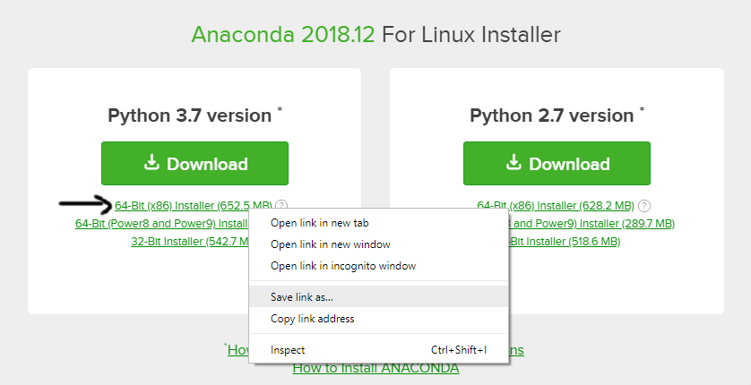
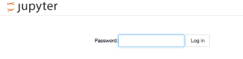

Setting up Jupyter on AWS EC2

This guide assumes a familiarity with AWS basics and a Windows OS on
local machine.

With an SSH connection to your EC2 instance (off a Linux AMI) that is
appropriate for you requirements, follow these steps:

[Install Anaconda on your instance]{.underline}

-   In your terminal with the SSH connection run the following:

    wget
    https://repo.continuum.io/archive/Anaconda3-4.2.0-Linux-x86\_64.sh

    You may wish to download the latest version, in which case, copy the
    link as shown below for your desired Anaconda version from
    <https://www.anaconda.com/download/#linux> and substitute it for
    Anaconda3-4.2.0-Linux-x86\_64.sh above. This will download the file
    to your EC2 instance.

    

-   Run this command to install the downloaded file:

    bash Anaconda3-4.2.0-Linux-x86\_64.sh

    Make sure you have inserted the correct version for your download.

    It will then ask you:

    Do you wish the installer to prepend the Anaconda3 install location
    to PATH in your /home/ubuntu/.bashrc ? \[yes\|no\] \[no\] \>\>\> yes

    Type in yes and hit 'Enter'.

    In some cases this may return an error. Here you will need to
    manually add the path to the .bashrc file

    Copy and paste:

    vim .bashrc

    If you are not comfortable using vim, nano might be a better choice.

    You will need to add this text to the bottom of the file:

    export PATH=\"/home/ec2-user/anaconda3/bin:\$PATH\"

    **[Note:]{.underline}** if you have downloaded Anaconda for python
    2.7, then 'anaconda3' should be changed to 'anaconda 2'

    Once saved, check to see if Anaconda3 is set as your default Python
    environment:

    which python /ec2-usr/bin/python

[Jupyter Notebook configuration]{.underline}

-   Create a password for access to Jupyter

    Enter the following commands

    ipython

    from IPython.lib import passwd

    passwd()

    Choose a password (save the sha1 encryption of your password in
    Notepad! You will need this later)

    Enter password: \[Create password and press enter\] 

    Verify password: \[Press enter\]

    'Here you will see the sha1 encryption of your password\'

    exit

-   Create a config profile

    jupyter notebook \--generate-config

-   Create the certificates for https

mkdir certs

cd certs

sudo openssl req -x509 -nodes -days 365 -newkey rsa:1024 -keyout
mycert.pem -out mycert.pem

You will be asked a series of questions. It doesn't matter how you
answer them.

-   Configure Jupyter (once more you can use nano instead of vi)

    cd \~/.jupyter/

    vi jupyter\_notebook\_config.py

    Insert this at the beginning:

    c = get\_config()

    \# Kernel config

    \# if you want plotting support always in your notebook

    c.IPKernelApp.pylab = \'inline\'

    \# Notebook config

    \#location of your certificate file

    c.NotebookApp.certfile = u\'/home/ubuntu/certs/mycert.pem\'

    c.NotebookApp.ip = \'0.0.0.0\'

    \#so that the ipython notebook does not opens up a browser by
    default

    c.NotebookApp.open\_browser = False

    \#the encrypted password we generated above

    c.NotebookApp.password =
    u\'sha1:98ff0e580111:12798c72623a6eecd54b51c006b1050f0ac1a62d\'

    \# Set the port to 8888, the port we set up in the AWS EC2 set-up

    c.NotebookApp.port = 8888

    **[Note:]{.underline}** replace the sha1 encryption with your own.

-   Create your notebooks folder

    cd \~

    mkdir Notebooks

    cd Notebooks

-   Start Jupyter notebook

    jupyter notebook

[Access Jupyter from your browser]{.underline}

-   Enter URL with the public IP of your instance and port 8888:

    https://ec2-52-39-239-66.us-west-2.compute.amazonaws.com:8888/

-   Upon prompt, enter the password that you chose earlier:

